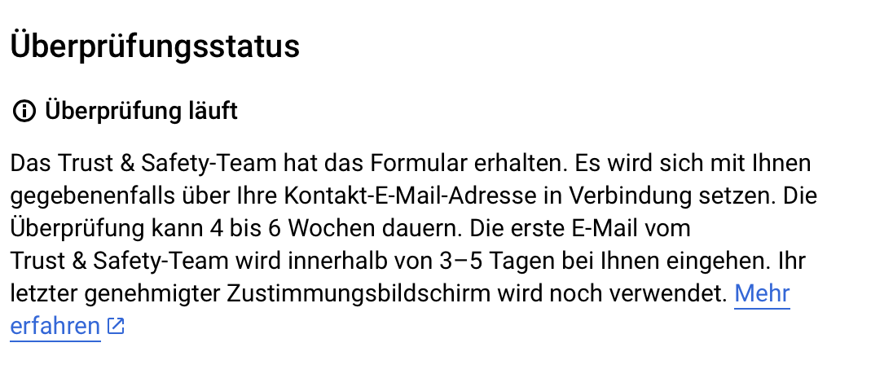

#  twitchbot

automatic twitchdownloader with optional twitter-bot function

## Help with Repo

⚠️ ****Pull Request Guidelines**** ⚠️

Pull requests should be done on the **`development`** branch only.

****Tasks:****

* Implement new features and improve existing ones to be better and more reliable.
* Restructure the program manly the twitterbot part(package it in the right way)

## Guide

**requirements**

- [(mini)conda](https://docs.conda.io/en/latest/miniconda.html)
- requirements.txt
- a storage for the streams and yt credentials
- .env files for twitter/twitch/ifttt credential
- Linux/MacOS/windows(might requier a bit more tinkering in comparison to the first 2)

**installation**

1. clone the repo
   `git clone https://github.com/iampickle/twitchbot.git`
2. conda env

   ```bash
   conda create -n -tbot
   conda install pip
   ```
3. install requirements.txt
   `pip install -r requirements.txt`
4. customize channels.json
   -example-

   ```json
    {
     "compress-server": {
       "ip": "192.168.188.12",
       "port": "8766"
     },
     "streamers": {
       "papaplatte": {
         "ytupload": true, //falg to enable yt-upload
         "tbot": {
           "start": 1, //start/end is for defining the 
           "end": 0.5, //puffer around the said word <puffer>|<word>|<puffer>
           "words": [ //if tbot obect exists also word-arry must be there
             "geil",
             "perfekt"
           ],
           "tiktokupload": true, //toggel tiktok upload cookies file need to be set in .env (https://github.com/wkaisertexas/tiktok-uploader#-authentication)
           "NOKEEP": true // if True folder of stream is deleted after Twitter-Bot is done
         }
       },
       "rezo": {} //channel without tbot object simply just record streams
     }
   }
   ```
5. create .env

   ```env
   #important dirs
   program-dir=<path of program location (git folder)> #important for start.sh when used in systemd
   conda-path=/home/<user>/miniconda3/bin/activate # <= very important
   dir=</your/path>
   channel-config=<./channels.json>

   #rendering options e.g. "libx264"
   codec=<codec>

   #db
   db-host=<url/ip to database>
   db-user=<username>
   db-password=<password>
   db-database=<database name>

   #vosk
   vosk-model=<vosk-model-small-de-zamia-0.3>

   #twitter
   bearertoken=<your-bearertoken>
   consumer-key=<your-consumer-key>
   consumer-secret=<your-consumer-secret>
   access-token=<your-access-token>
   access-token-secret=<your-access-token-secret>

   #twitch
   Client-ID-Twitch=<your-Client-ID-Twitch>
   Authorization-Twitch=<your-Twitch-Authorization>

   #IFTTT
   Authorization-IFTTT=<your-IFTTT-Authorization>
   event=<your-event-name>
   ```
6. create dir for tbot
   example: /your/folder/...

   ```tree
   .
    └── mainfolder/ 
       ├── streamer1/ 
       │   └── steamer1-date/ 
       │       └── stream.mp4 
       ├── streamer2/
       │   └── steamer2-date/ 
       │       ├── analytics/
       │       │   ├── 2b762e54-a315-495c-bd62-f65ee4f5390e.png(viewer chart)
       │       │   ├── 2b762e54-a315-495c-bd62-f65ee4f5390e.png(word count)
       │       │   └── 2b762e54-a315-495c-bd62-f65ee4f5390e.png(top table)
       │       ├── output/
       │       │   └── stitched.mp4 
       │       └── stream.mp4 
       └── .yt-credentials/ 
           └── client_secret.json
   ```
7. .yt-credentials/
   client_secret.json([tutorial](https://developers.google.com/youtube/v3/guides/authentication?hl=de))
   Verification of endpoint needs to be started(endless uncompletion)

   

## Tools (usage info)

### createcredential.py

-can be used if all requirements are rightfully installed

-for non local applications(server) script can be executed localy or ssh-tunnel can be used in order to login via google-account

### start-twitterbot.py

-script needs to be copied into main-dir

-vars in function args need to be manipulated

## License

[MIT](https://choosealicense.com/licenses/mit/)
